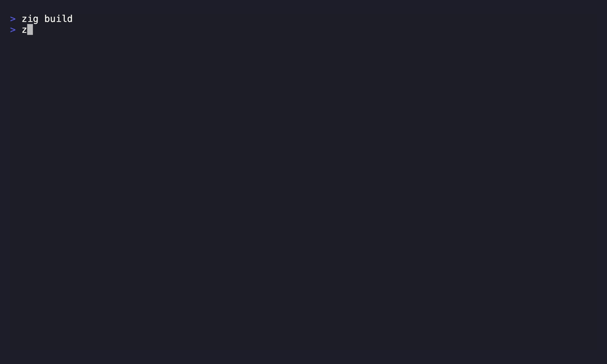

# slyph
a terminal web browser with its own engine, in pure zig<br>
no chromium, no webkit, no servo.

<p align="center">
  
</p>

<p align="center">
  
  
  
</p>

zig 0.16, single binary
- fetches raw bytes and runs the whole pipeline itself:<br>
`fetch > html parse > dom > css cascade > layout > render > terminal cells`
- networking via zig std (`std.http.Client` + `std.crypto.tls`)
- the only planned non-zig code is QuickJS (C) for js, at v0.2

## why
browsers obey the server: the site says which cookies are "required," ships whatever js it likes, the browser complies.<br>
slyph inverts that. it parses and runs everything itself, **every stage is a point where _you_, not the site, decide what's necessary.** running zero js is the most radical "deemed unnecessary." the cookie and css deny policies are the first concrete slices: one deny-rule surface, consulted per pipeline stage.

> **[ ! ]** v0.1 is early. a working pure-zig text browser end to end:
> - fetch + cookies, html5 parse, css cascade, block/inline layout, ansi render,
> - scroll, links, forms, login. no javascript yet. expect rough edges.

## version
<b>v0.1.2 (latest)</b>
+ external `<link rel=stylesheet>` now fetched + cascaded (was inline `<style>` only)
+ css custom properties + `var(--x, fallback)`, `:root` selector
+ user-owned css deny policy (`~/.slyph/css.policy`), same engine as cookies
+ truecolor when the terminal supports it, else graceful xterm-256 fallback
+ no flicker between page loads; live terminal resize

<details>
<summary>previous</summary>
<b>v0.1.1</b>
+ reload + back/forward history, with an in-app error page when a fetch fails
+ full keyboard scroll: arrows, page up/down, home/end
+ status bar shows the current url + scroll position

<b>v0.1</b>
+ pure-zig text browser end to end, zero C
+ html5 tokenizer + tree builder → dom
+ css parser + cascade + computed style (specificity, inherit)
+ block/inline layout → box tree (margins, wrap, lists, pre)
+ text-mode ansi renderer + scrolling tui
+ forms (text/pw/checkbox/radio/submit), GET + POST
+ cookie jar (Set-Cookie capture/replay/persist), redirects per-hop
+ user-owned cookie deny policy
+ in-app url bar + configurable banner start page
</details>

## build
```sh
zig build                              # → zig-out/bin/slyph
zig build install --prefix ~/.local    # → ~/.local/bin/slyph
zig build test                         # unit tests
```

## run
```sh
slyph                 # start page (your bookmarks)
slyph example.com     # load a url (bare host → https)
slyph https://lobste.rs
slyph example.com | less   # piped → plain-text dump
```

## commands
<details>
<summary>view</summary><br>

| key            | action                        |
| -------------- | ----------------------------- |
| `j` / `k` / arrows | scroll line down / up     |
| `d` / `u`      | half-page down / up           |
| `space` / `b`  | half-page down / up           |
| `PgUp` / `PgDn`| page up / down                |
| `g` / `G` / `Home` / `End` | top / bottom      |
| `f`            | follow a `[n]` link           |
| `i`            | edit / activate a `{n}` field |
| `r`            | reload                        |
| `Ctrl+L` / `:` | open the url bar              |
| `H` / `L`      | back / forward                |
| `q`            | quit                          |
</details>

## storage/config
all user state lives under `~/.slyph/`, seeded on first run so every default is
visible and editable:
- `~/.slyph/start` - start-page links, `name<TAB>url`, one per line.
- `~/.slyph/cookies.txt` - persisted (non-session) cookies.
- `~/.slyph/cookies.policy` - deny rules `deny <domain-glob> <name-glob>`.
- `~/.slyph/css.policy` - deny rules `deny <domain-glob> <property-glob>`.

cookies.policy ships seeded with common tracker rules; anything not denied is
accepted as usual. css.policy ships opt-in (examples commented) so styling is
unchanged until you add a rule - e.g. `deny * color` to ignore author text colors.

> **[ ! ]** session cookies stay in memory only; just `cat`/edit the files.

## known limitations
- no javascript yet - js-heavy app sites (gmail, telegram, discord) render mostly empty. static / server-rendered sites work now.
- `std.crypto.tls` (zig 0.16) handshakes fail on some ecdsa-cert hosts (e.g. `news.ycombinator.com`). most sites work; bounded upstream gap.
- no flexbox/grid, images, or video yet.

## planned
- quickjs + core dom bindings > light-js sites
- flexbox / grid + more dom/cssom > modern layouts
- pixel mode (sixel / kitty + ansi-block fallback) > images
- heavy js apps, eventually media

## contribution
free + open source, GPL-3.0. issues and PRs welcome; no guarantee of merge.

> **[ ! ]** thank you for your attention

